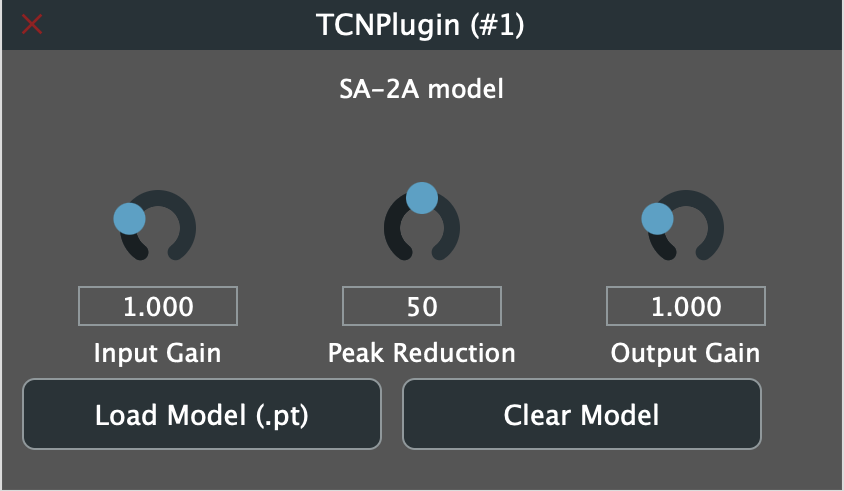

# SA-2A TorchScript Plugin

This repository contains a separate real-time JUCE plugin for hosting a TorchScript `.pt` model of an SA-2A-style optical compressor.

It is **not** the offline recording or dataset-capture tool used for the paper. Instead, it was created to run the learned compressor model in a live audio context and to provide a simple real-time interface for testing a PyTorch-exported model.

A prebuilt VST3 package is provided in `TCNPluginvst3.zip`.

## Screenshot

   
  <em>SA-2A TorchScript plugin user interface.</em>

## Overview

The plugin loads a single TorchScript model file and exposes three main controls:

- Input Gain
- Peak Reduction
- Output Gain

The loaded model is applied in real time to the incoming audio signal. If no model is loaded, the plugin behaves as a gain-only pass-through processor.

## Included Formats

The plugin project is configured for:

- VST3
- AU
- Standalone

A prebuilt VST3 version is included in `TCNPluginvst3.zip` for convenient use without rebuilding from source.

## Features

- Real-time JUCE audio plugin
- Loads a single TorchScript `.pt` model
- Designed for SA-2A-style compressor emulation
- Three user controls:
  - Input Gain
  - Peak Reduction
  - Output Gain
- Model loading and model clearing from the plugin UI
- Stereo input/output support
- Automatic pass-through behavior when no model is loaded
- Fixed internal frame size of 512 samples for model inference

## Plugin Controls

| Control | Range | Description |
|---|---:|---|
| Input Gain | 0.0 to 4.0 | Linear gain applied before model inference |
| Peak Reduction | 0.0 to 100.0 | Conditioning value passed to the model |
| Output Gain | 0.0 to 4.0 | Linear gain applied after model inference |
| Load Model (.pt) | — | Loads a TorchScript model file |
| Clear Model | — | Unloads the currently loaded model |

## Model Requirements

The plugin expects a TorchScript `.pt` file exported from PyTorch.

The model must provide a `forward()` method that accepts:

- an input audio tensor
- a peak-reduction tensor

The current implementation is built around a fixed internal frame size of **512 samples**.

For best results, the exported model should be compatible with frame-based real-time inference.

## How the Plugin Works

When audio is processed:

1. The input block is copied into an internal buffer.
2. The buffer is multiplied by the current Input Gain.
3. The current Peak Reduction value is passed to the model as a conditioning tensor.
4. The model is executed without gradients.
5. The output is multiplied by Output Gain.
6. The processed samples are written back to the host buffer.

If no model has been loaded, the plugin applies the input and output gain stages and returns the signal without learned processing.

## Usage

### Using the VST3 Package

1. Unzip `TCNPluginvst3.zip`.
2. Copy the `.vst3` bundle to your system’s VST3 plug-in folder, for example:
   - macOS: `~/Library/Audio/Plug-Ins/VST3/`
3. Scan the plug-in in your DAW.
4. Open the plug-in UI and click **Load Model (.pt)**.
5. Select a TorchScript model file.
6. Adjust **Input Gain**, **Peak Reduction**, and **Output Gain** as needed.

### Using the Standalone App

If you build the project from source, the plugin can also be run as a standalone application.

### Clearing the Model

Click **Clear Model** to unload the currently loaded TorchScript module and return to gain-only behavior.

## Stereo Operation

The plugin is configured for stereo input and output.

Each channel is processed independently, while using the same loaded model and the same Peak Reduction control value.

## Build Requirements

- JUCE
- CMake
- LibTorch
- A C++17 compiler

## Build Notes

The project is configured with:

- JUCE plugin formats: VST3, AU, Standalone
- C++17
- TorchScript model loading

If you use a custom LibTorch installation, make sure the Torch CMake package is discoverable during configuration.

## Limitations

- Only one model file can be loaded at a time.
- Host state persistence is not implemented.
- The plugin is centered on a 512-sample processing window.
- Stereo I/O is required.
- The model must be exported as TorchScript and compatible with the plugin’s two-input forward call.

## Relationship to the Research

This plugin is a separate real-time implementation developed alongside the broader SA-2A modeling work.

It is intended for live evaluation and model deployment, and it is distinct from the offline dataset-generation and training framework used for the paper.

## File Layout

Typical files in this repository include:

- `Source/CMakeLists.txt`
- `PluginProcessor.cpp`
- `PluginProcessor.h`
- `PluginEditor.cpp`
- `PluginEditor.h`
- `TCNPluginvst3.zip`
- `SA-2A Plugin UI Screenshot.png`

## Notes

The model-loading workflow is intentionally simple:

- load one `.pt` file
- adjust the three controls
- clear the model when needed

This keeps the plugin focused on real-time evaluation of a TorchScript compressor model rather than on preset management or complex host-side state handling.
